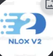

<h1 align="center">Nlox Launcher</h1>

<em><h5 align="center">(Launcher avec Electron Launcher)</h5></em>

[
](https://travis-ci.org/dscalzi/HeliosLauncher)  

Rejoingnez la Communauté de Nlox Discord : https://discord.gg/wsWANgw Rejoignez les Joueurs a Jouer a Nlox.

## Fonctionnalité

* 🔒 Gestion complète du compte.
  * Ajoutez plusieurs comptes et basculez facilement entre eux.
  * Les informations d'identification ne sont jamais stockées et transmises directement à Mojang.
* 📂 Gestion efficace des actifs.
  * Recevez les mises à jour des clients dès que nous les publions.
  * Les fichiers sont validés avant le lancement. Les fichiers corrompus ou incorrects seront téléchargés à nouveau.
* ☕ ** Validation Java automatique. **
  * Si vous avez une version incompatible de Java installée, nous installerons la bonne * pour vous *.
  * Vous n'avez pas besoin d'installer Java pour exécuter le lanceur.
* 📰 Flux d'actualités nativement intégré au lanceur.
* ⚙️ Gestion intuitive des paramètres, y compris un panneau de contrôle Java.
* Prend en charge tous nos serveurs.
  * Basculez facilement entre les configurations de serveur.
  * Afficher le nombre de joueurs du serveur sélectionné.
* Mises à jour automatiques. C'est vrai, le lanceur se met à jour.
* Voir l'état des services de Mojang.

Téléchargé et installer le Launcher
